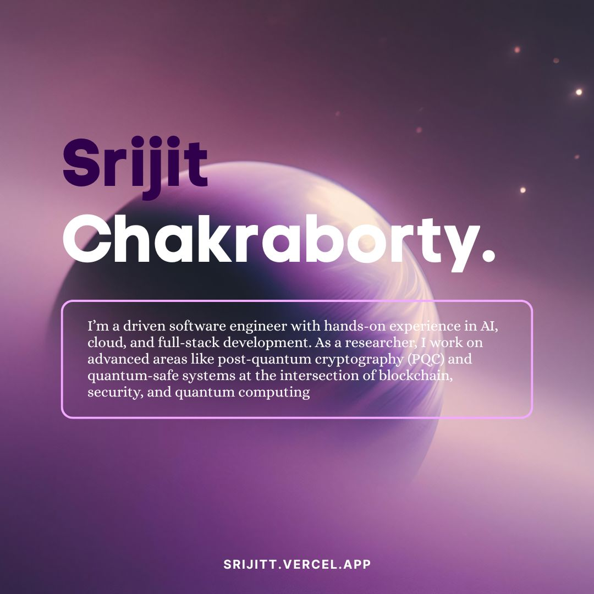

# Srijit Chakraborty – Portfolio

Welcome! This is the source code for my personal portfolio website.  
I'm Srijit Chakraborty — a software engineer, fullstack developer, and quantum-safe researcher based in Kolkata.

---

## 👋 About Me

Hey! I'm Srijit — a software engineer who loves building apps, playing with AI, and exploring post-quantum cryptography.  
I've interned at IBM, shipped real projects, and I'm always up for a new challenge (or a good tech meme).

- 💼 Research Intern at IBM
- 🌎 Based in Kolkata
- ☕ Interests: Software, AI, Post-Quantum Cryptography, Fullstack, Quantum Safe
- 📧 srijit.chakraborty154@gmail.com

---

## 🚀 What’s in this Portfolio?

- **About Me:** My background, skills, and interests.
- **Portfolio:** A showcase of my favorite projects, including [QForge](https://qforge.vercel.app), [iema.ai](https://www.iema.ai), and [Smart Switch](https://github.com/srijitt/smart-switch/).
- **Responsive Design:** Looks great on any device.
- **Dark Mode:** Because everyone loves a good dark theme.
- **Modern Stack:** Built with React, Vite, Material UI, Tailwind CSS, and SCSS modules.

---

## 🛠️ Tech Stack

- React, Vite, Material UI, Tailwind CSS, SCSS Modules
- React Router, Font Awesome
- Custom hooks and modular components

---

## 📁 Project Structure
